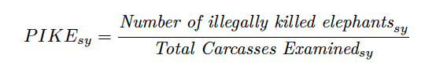

     

# MIKE-GLMM
PIKE TREND ANALYSIS USING A BAYESIAN GENERALISED LINEAR MIXED MODEL (GLMM) APPROACH IN R
CITES MIKE Programme
November 2020

This repository contains R script for analyse of data from the Monitoring the Illegal Killing of Elephants (MIKE) Programme to produce outputs for reports to the Convention for International Trade in Endangered Species of Wild Fauna and Flora (CITES).
The MIKE Programme is a site-based system designed to monitor trends in the illegal killing of elephants, build management capacity and provide information to help range States make appropriate management and enforcement decisions. MIKE evaluates relative poaching levels based on the Proportion of Illegally Killed Elephants (PIKE), which is calculated as the number of illegally killed elephants found divided by the total number of elephant carcasses encountered, aggregated by site and across year.

The analytical approach documented here has been recommended by the MIKE-ETIS Technical Advisory Group (TAG) after the review of the MIKE analytical methodology initiated by the CITES Secretariat in collaboration with the MIKE-ETIS TAG.  Various methodologies / models were considered and the use of a Bayesian generalised linear mixed model (GLMM) approach, with model results unweighted by local elephant population estimates were recommended by the TAG to replace the previous modelling approach [estimated marginal means (LSmeans)] that had been used in previous reports considered by the meetings of the Conference of Parties to CITES and CITES Standing Committee. The Bayesian GLMM approach was used to report PIKE trends in the MIKE report: PIKE trend analysis – Methodology and Results, released by the CITES Secretariat in November 2020. 

# MIKE - GLMM Model for PIKE

This GitHub sites contains code and reports to
estimate yearly-trends in the Proportion of Illegally Killed Elephants (PIKE) from 
MIKE (Monitoring Illegally Killed Elephants) monitoring sites in Africa since 2003.

Briefly, MIKE data is collected on an annual basis in designated MIKE sites by law enforcement 
and ranger patrols in the field and through other means. 
When an elephant carcass is found, site personnel try to establish the cause of death and other details, 
such as sex and age of the animal, status of ivory, and stage of decomposition of the carcass. 
This information is recorded in standardized carcass forms, details of which are then submitted to the 
MIKE Programme. 
As expected, different sites report widely different numbers of carcasses, 
as encountered carcass numbers are a function of: population abundance; natural mortality rates; 
the detection probabilities of elephant carcasses in different habitats; 
differential carcass decay rates; 
levels of illegal killing; and levels of search effort and site coverage. 
Because of these features of the survey data, the number of carcasses found is unlikely to be 
proportional to the total mortality and trends in observed numbers of 
illegally killed elephants may not be informative of the underlying trends. 

Consequently, the observed proportion of illegally killed elephants (PIKE) as an index of 
poaching levels has been used in the MIKE analysis in an attempt to account for 
differences in patrol effort between sites and over time:

  

where the subscripts _sy_ refer to site and year respectively.

This GitHub site contains code and reports on using a Generalized Linear Mixed Model (GLMM)
to analyze the MIKE data. This is an improvement over using a simple linear model on
the raw proportions (the *LSMeans* approach)

# Structure of this repository
You will have to insert your google key in the *register_google_key.R* file so that
the programs can downloap maps of Africa and Asia. See ?register_google 
after loading the ggmap package.

There are several directories in this repository

- Code. This contains the .Rmd files and associated functions for fitting and analysing the MIKE data.
The key documents are the 
  * Africa.technical.Rmd
  * Africa.summary.Rmd
  * Asia.technical.Rmd
  * Asia.summary.Rmd
files.   
These load the 
  * *fitting-functions-R* files that contain functions for the analysis
  * *read.xxx.R* files that read in and pre-process the data for Africa and Asia
- Data. This contains the data used in the MIKE analysis.
- ReportsAndEstimates. This contains the reports generated by the Asia/Africa x technical/summary documents 
plus the estimates of the 

# Updating with a new year of data

The following steps should be followed to update the estimates when a new set of data is
available. The steps for the Africa reports are given below; the steps for Asia are similar

- Update the files in the *Data* directory.
Note that the population estimates (*MIKE pop est* files) must be *.xlsx* so that the bolding
of years when a population survey takes place can be extracted.
- Update the *read.africa.R* file in the *Code* directory to point to the new file names
- Run the *africa-sens-drop-site.R* file to estimate and save the sensitivity to dropping new sites.
This is run separately because it takes a LONG time to run and it was easier to run once and then
use the created files in the technical/summary reports than embed the code in the technical/summary
Rmd files.
- Open and knit the *Africa.technical.Rmd* and *Africa.summary.Rmd* documents to create the html/pdf documents.
This will take two runs, one for the *html* file and one for the *pdf* file.
- Put the date of creation in the front of the created html/pdf files and move to the *ReportAndEstimates* directory.
- Put the date of creation in the front of the created *report.africa.estimates.csv* file and
move to the *ReportAndEstimates* directory.
- Put the date oc creation in the front of the created *.Rdata* files which saves the 
posterior samples from the continental or subregional fits. You likely will NOT want to manage these
files with GitHub because of their size.

# Change Log

## 2020-10-29

Restructuring of the repository. Re-initialized the repository. Minor typo corrections. Save estimates
and .RData files to the directory.

